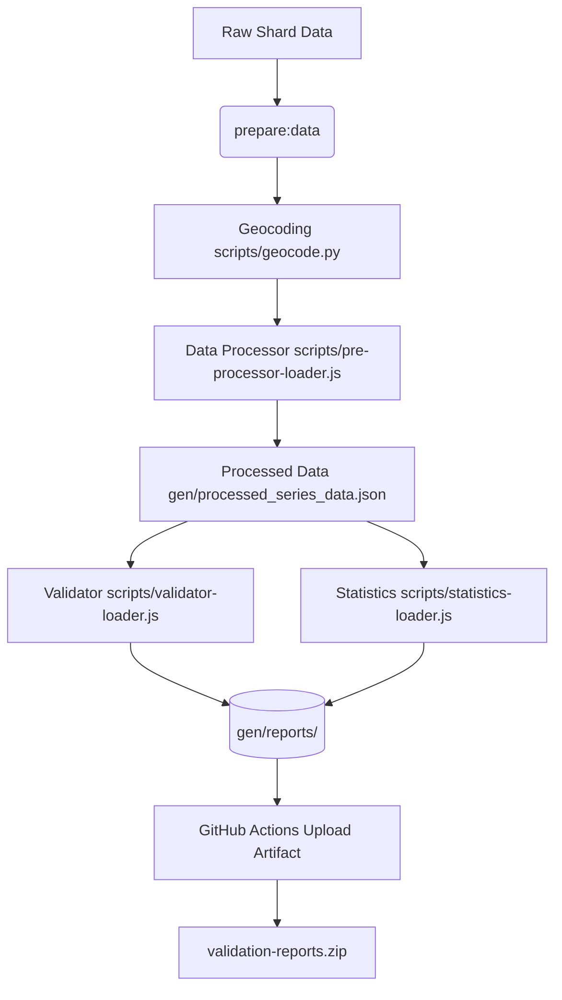

# Validation and Reporting System

This document outlines the compile-time data validation and reporting architecture for the `ingress-shards.github.io` project.

---

## 1. Architecture Overview

To ensure data integrity and track anomalies across Ingress shard events, validation and statistics calculation are executed directly during the main build lifecycle (`prepare:data`). This guarantees that static data reports are always up-to-date and packaged directly into the web application's distribution directory.



---

## 2. Generated Reports & Schemas

The validator and statistician produce exactly **6 static assets** in `gen/reports/` for consumption by external diagnostic tools and services. These are subsequently zipped and attached to GitHub Action runs:

### 1. `missing-shard-actions.csv`
Contains expected actions (such as spawns or jumps) that were scheduled but are missing from the raw site logs.
- **Headers**: `Season`, `Site`, `Wave`, `Shard ID`, `Action`, `Scheduled`
- **Fields**: `'Season'` and `'Site'` columns are populated by their unique season and site IDs (e.g. `2026-orion`, `2026-orion-prague`) instead of names.

### 2. `actions-outside-window.csv`
Identifies shard actions that occurred outside of the expected 1-minute window of their scheduled wave timing.
- **Headers**: `Season`, `Site`, `Wave`, `Shard ID`, `Action`, `Scheduled`, `Actual`, `Delta`

### 3. `invalid-shard-sequences.csv`
Traces shards that underwent impossible transitions (e.g., origin portals not matching the prior destination, or illegal jumps after/before despawns).
- **Headers (in this exact order)**: `Season, Site, Wave, Shard ID, Action, Valid, Origin, Destination, Link Time, Move Time`
- **Valid Column**: A boolean indicator (`1` for true/valid, `0` for false/invalid) positioned directly after `Action` showing if the specific step's origin portal matches the sequence. No emoji modifiers are present in portal columns, ensuring quote-safety and spreadsheet compatibility.

### 4. `link-alignment-mismatches.csv`
Records instances where a shard moved along a link, but the link team or owner did not align with the portals' actual captures or state.
- **Headers (in this exact order)**: `Season`, `Site`, `Wave`, `Shard ID`, `Time`, `Origin Portal`, `Destination Portal`, `Origin Team`, `Link Team`, `Destination Team`
- **Wave Column**: Dynamically computed at compile-time by determining which wave the shard was active in.

### 5. `site-statistics.csv`
Tracks site-level action latency, timing statistics, and intervals to monitor site performance.
- **Headers**: `Season`, `Site`, `Wave`, `Scheduled`, `Action`, `Count`, `First Action`, `Last Action`, `Avg Interval`, `Avg Latency`

### 6. `validation-summary.json`
A granular nested JSON summary showing anomaly counts split by **Season** and **Site ID**.
- **Granular Rules**: Only add a Season in the summary if a site has validation issues, and only add a Site if it has validation issues. Anomalies are limited to values strictly **greater than 1** (`val > 1`), except for `linkAlignmentMismatches` which includes any occurrences **greater than 0** (`val > 0`).
- **Property Names**: Properties are named cleanly without `"Count"` suffixes (e.g. `invalidShardSequences`).
- **Unique Entry Grouping**: The `invalidShardSequences` metric tracks the number of *unique invalid sequence entries* by grouping error steps by `${siteId}_${row.Wave}_${row['Shard ID']}` rather than counting raw rows.
- **Example format**:
```json
{
  "2026-orion": {
    "2026-orion-prague": {
      "missingShardActions": 45,
      "shardActionsOutsideJumpWindow": 30,
      "invalidShardSequences": 16
    }
  }
}
```

---

## 3. CI Artifact Integration

To keep the web frontend extremely lightweight, we do not package the validation anomaly data into the public client application. Instead, data integrity checks are leveraged exclusively by maintainers during the CI/CD pipeline:

- **Build Generation**: During the `data:validate` phase, `validator-loader.js` processes all series rulesets against the generated jumps, outputting the granular findings to `gen/reports/`.
- **GitHub Actions Upload**: In both `.github/workflows/preview.yml` and `.github/workflows/release.yml`, a step executes immediately following `npm run build` that aggregates the `gen/reports/` directory.
- **Artifact Access**: Using `actions/upload-artifact@v7`, the reports are attached to the workflow run as a downloadable `validation-reports` artifact, containing the full suite of diagnostic CSVs and JSON.

---

## 4. High-Quality DRY Shared Helpers

To maintain a clean and highly maintainable codebase, both the statistics calculator and the validator utilize shared formatting and serialization helpers from `src/js/data/shard-jumps/data-helpers.js`:

- **`convertToCsv(data)`**: Iterates over structured objects, extract headers, and serializes rows. Target portal names (containing `Origin`, `Destination`, or `Portal`) are cleanly wrapped in double-quotes to ensure quote-safety and spreadsheet compatibility.
- **`formatZonedDateTimeWithMs(zdt)`**: Formats `ZonedDateTime` instances using consistent milliseconds formatting (`HH:MM:SS.mmm`).
- **`formatTimeWithMs(epochMs, timezone)`**: Handles epoch millisecond translation to zoned local time strings.
- **`formatDurationMs(durationMs)`**: Consolidates latency formatting into structured duration outputs (e.g., `1m 24.5s` or `8.3s`).
